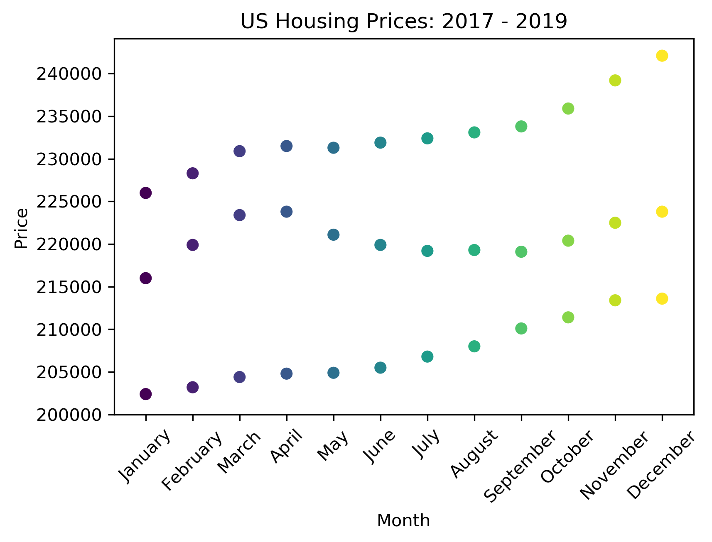
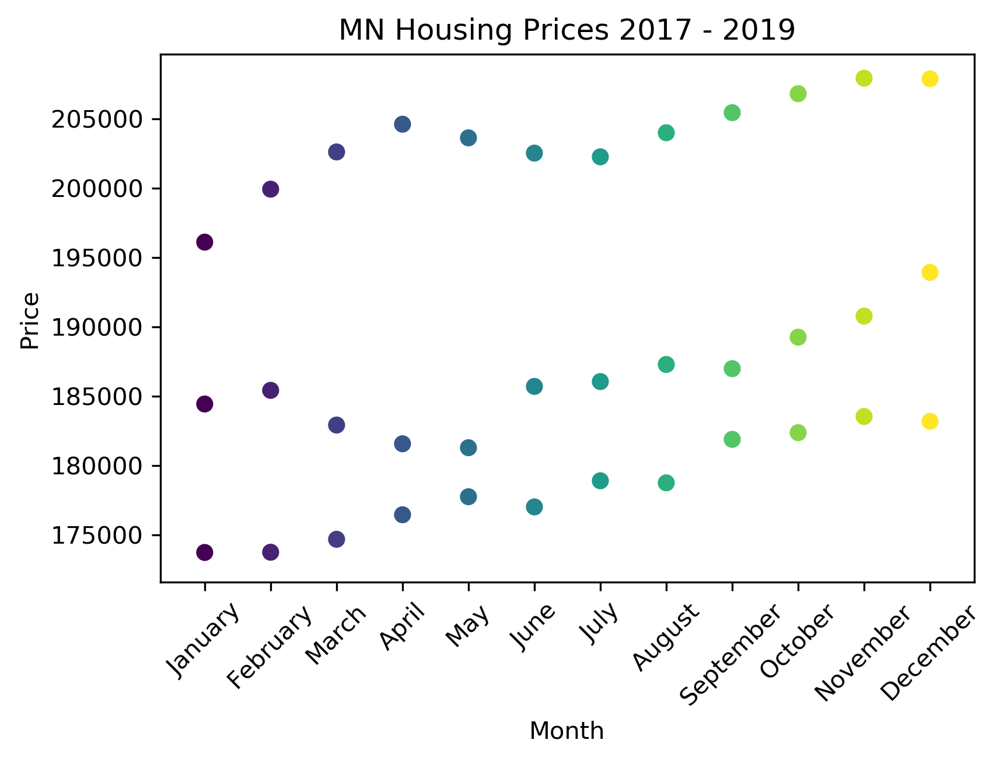
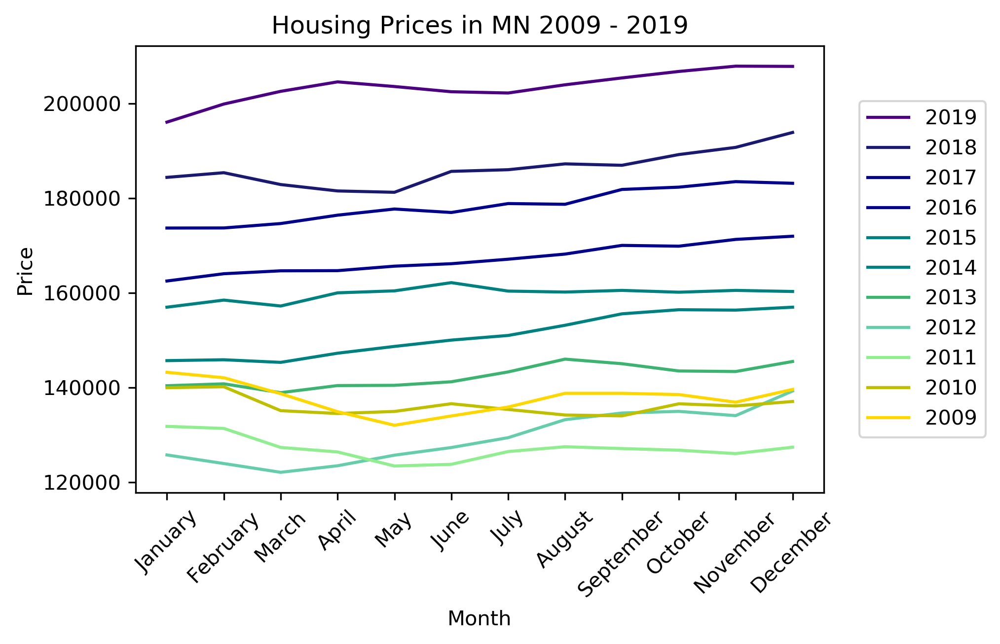

# Zillow Housing Market Analysis

## Introduction

The purpose of this project was to analyze housing market prices using Zillow data and identify trends and graph the results.

## Built With

* [Python](https://www.python.org/) - The language used for coding
* [Jupyter Notebook](https://jupyter.org/) - The software used for coding
* [Pandas](https://pandas.pydata.org/) - The library used to generate data frames and filtering data
* [Matplotlib](https://matplotlib.org/) - The library used for creating graphs

### Overview of Code

* Python code was generated to upload csv data into a Jupyter Notebook.  
* Pandas sliced and diced the data to section it out based on various fields (Year, Location, Median Home Prices).
* Matplotlib was used to plot the graphs and save copies of the respective images.  
* Scatter Plots and Line Graphs were created for visuals.  

### Research Questions

* When is the best month of the year to purchase a home?
* Has the housing market bounced back since the housing collapse in 2009?
* How does the US housing market compare to Minnesota?

## US Scatter Plot
 

Overall there is a general trend upward for home prices over the three years. 
There are not any visible relationships between home prices and month.  

## US Line Graph

This graph shows home prices declining from 2009 to 2011 in yellow and green.
Then prices start to increase in 2013 where they reach their pre-recession values.  

## MN Scatter Plot

Minnesota home prices mirror the US, but is a little more volatile with more peaks and valleys.

## MN Line Graph

Again, Minnesota home prices mirrors the US with a decline from 2009-2011 and increases from 2012 onward.  
In all 4 graphs, there are not any visible relationships between home prices in month.
This means determining an "optimal month" to purchase a home is not feasible.  
Home pricse are likeley more related to external factors as opposed to the time of  year.

## Authors

* **Emily Mobley** - *Data collection, coding, analysis and charting

## Sources

* [Zillow Housing Data](https://www.zillow.com/research/data/) - Data was exported from Zillow's research data website

