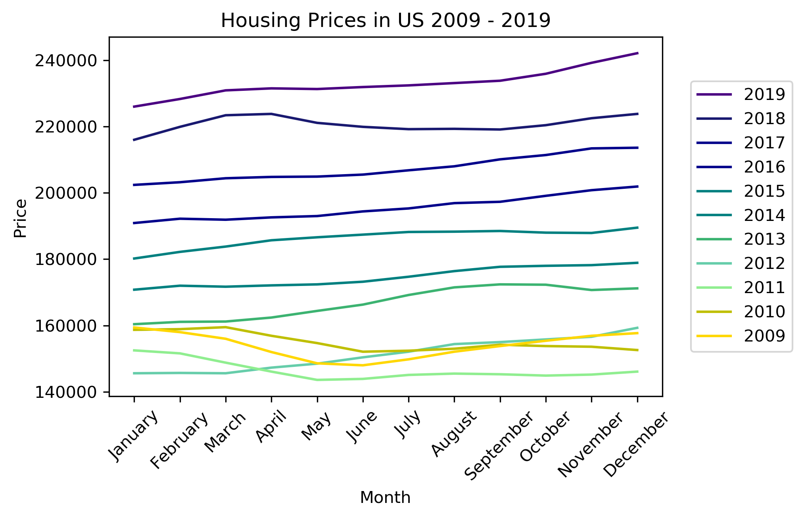

# Zillow Housing Market Analysis

## Introduction

The purpose of this project was to analyze housing market prices using Zillow data and identify trends.  

<a href="https://i.postimg.cc/90qpW2dX/MN-Line.png"></a>

## Built With

* [Python](https://www.python.org/) - The language used for coding
* [Jupyter Notebook](https://jupyter.org/) - The software used for coding
* [Pandas](https://pandas.pydata.org/) - The library used to generate data frames and filtering data
* [Matplotlib](https://matplotlib.org/) - The library used for creating graphs

### Overview of Code

* Python code was generated to upload csv data into a Jupyter Notebook.  
* Pandas sliced and diced the data to section it out based on various fields (Year, Location, Median Home Prices).
* Matplotlib was used to plot the graphs and save copies of the respective images.  
* Scatter Plots and Line Graphs were created for visuals.  

### Research Questions

* When is the best month of the year to purchase a home?
* Has the housing market bounced back since the housing collapse in 2009?
* How does the US housing market compare to Minnesota?

## Images
{:height="50%" width="50%"}
 
 
 

## Authors

* **Emily Mobley** - *Data collection, coding, analysis and charting

### Tools Used

The following tools were used during the analysis.

```
Python
Jupyter Notebook
Pandas
Matplotlib
```

## Sources

* [Zillow Housing Data](https://www.zillow.com/research/data/) - Data was exported from Zillow's research data website

